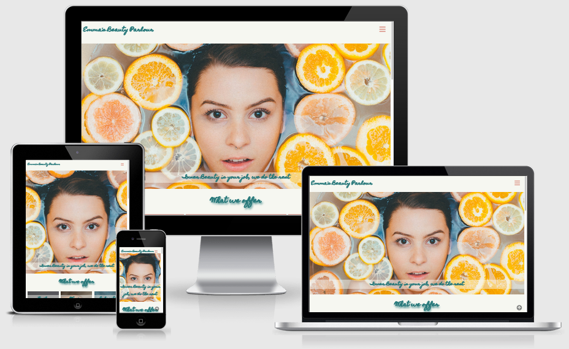
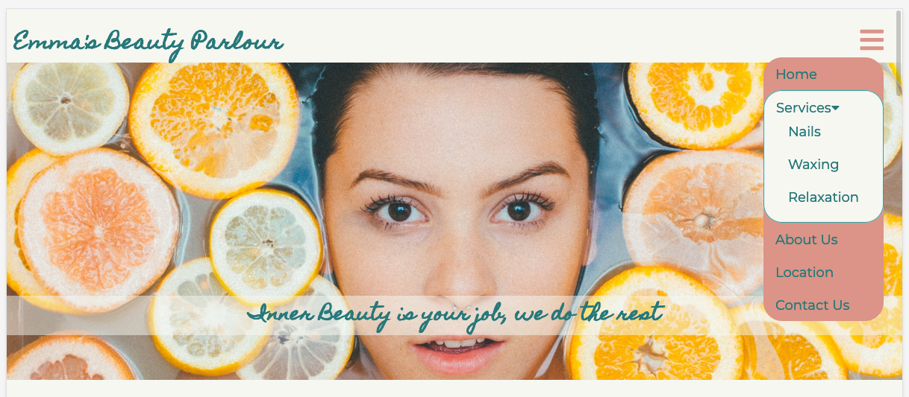
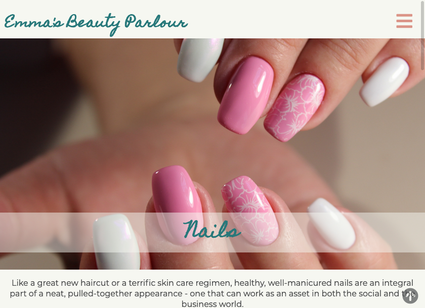
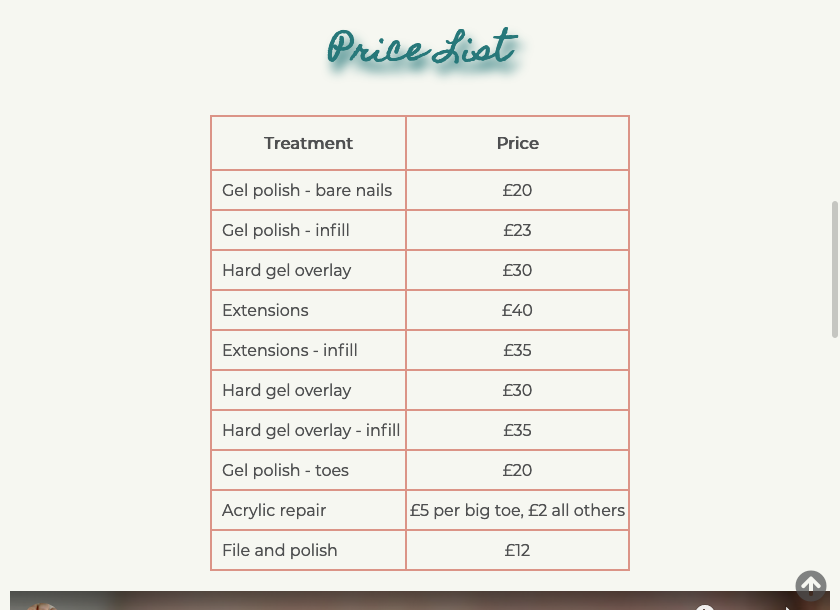
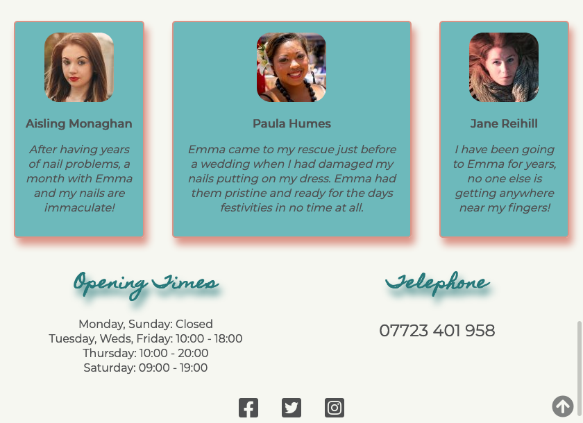
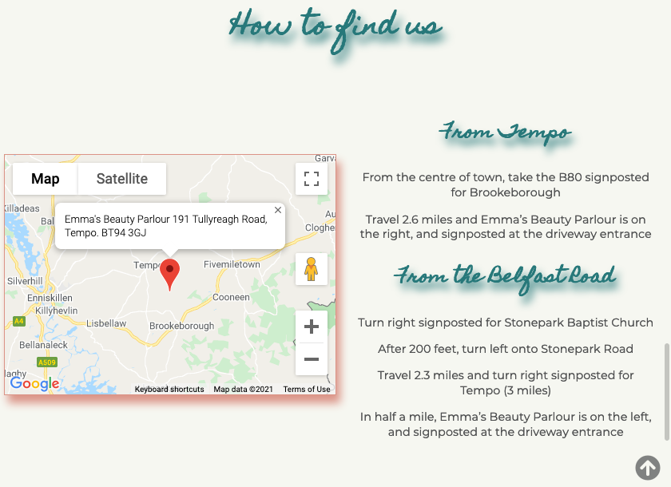
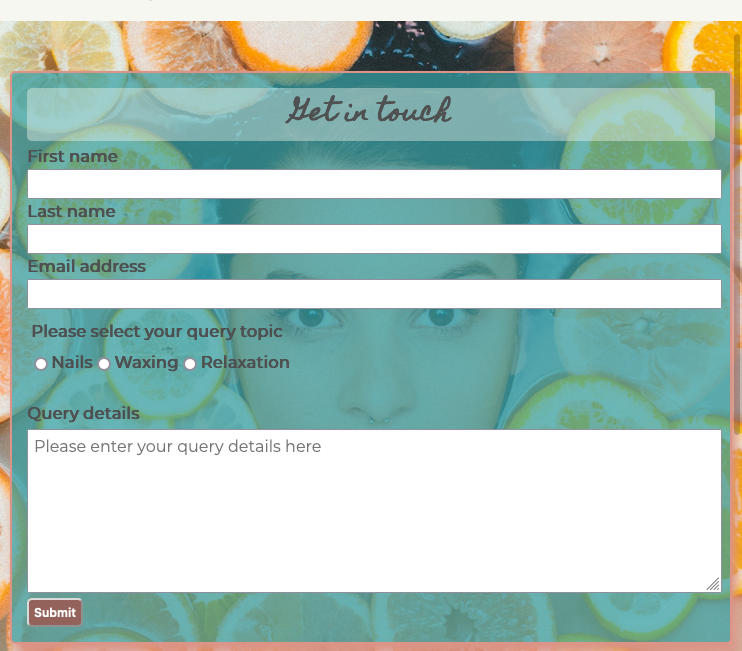
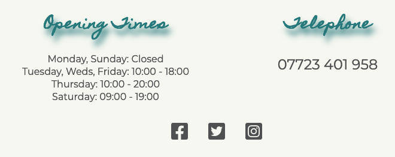
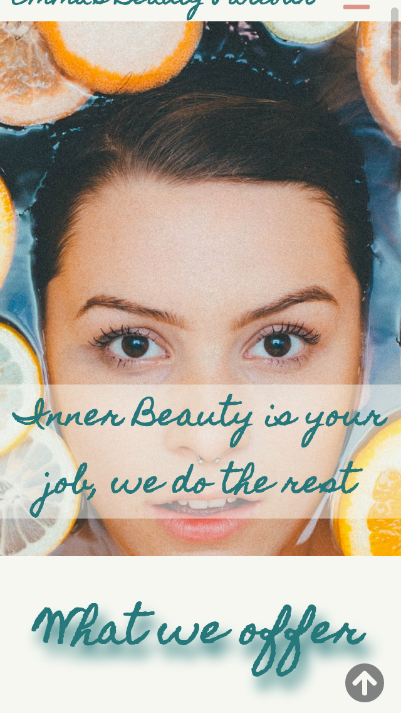

# Emma's Beauty Parlour

Emma's Beauty Parlour is a sole trader beautician business based in Tempo, County Fermanagh, Northern Ireland.

Following a hiatus from work due to a pregnancy and the covid pandemic, the client is recommencing business, but has moved from rented retail premises to premises adjoining her dwelling house.

Until now the client had been using social media channels and word of mouth to drive business leads, but during the pandemic she seen how useful a website was for her competitors during lockdown and now wants to get one set up for her own business.

You can now view the [live website](https://chris-mcgonigle.github.io/emmas-beauty-parlour/).

## Table of Contents

1. [Site Design Considerations] (##Site Design Considerations)
  * [Client Expectations](###Client Expectations)
  * [User Stories/Expectations](### User Stories/Expectations)
2.  

## Site Design Considerations

### Client Expectations

The basic functions that the client wants the website to feature are:
* a list of the services provided (including pricing structure and any relevant Health & Safety Information)
* a CV/professional experience section
* photos of procedures and/or finished product photos
* detail the new business location
* a section for client testimonials
* a contact/enquiry form

The client wishes the site to convey a feeling of peace and relaxation as is in keeping with the overall ethos of the business and the sector in general.

The client also wishes to have the ability to include extra functionality at a future date, including online booking and eventually an e-commerce section.

If possible, the client also wishes to be able to monitor the traffic to the site.

The website is aimed at a female audience, who make up 95% of the clients custom.

### User Stories/Expectations

1. As a user, I want to easily ascertain the purpose of the website.
2. As a user, I want to be able to easily find out the services on offer.
3. As a user, I want to be able to find out the cost of each service provided. 
4. As a user, I want to be provided with a short description about each service and the time it will take.
5. As a user, I want to be provided with directions to the business.
6. As a user, I want to be able to easily find the business contact details. 
7. As a user, I want to be able to find social media links to the business.
8. As a user, I want to be able to provide feedback or comment through the site without having to exit and use my mail client.
9. As a user, I want to be able to navigate through the site freely, in a manner which is easily understood.
10. As a user with disabilties, I want to be able to navigate through the site freely without obstruction.
11. As user, I want to be able to view the website on any of my devices without any loss of functionality.

### Site Design Approach

As is standard industry practise nowadays the site is to be designed from a mobile first perspective. As of May 2021, mobile devices account for 55% of web traffic, desktop 42% and 3% tablet. (source:[Statcounter.com](https://gs.statcounter.com/platform-market-share/desktop-mobile-tablet))

This market share has been increasing over time, so approaching projects from a mobile first perspective is essential to ensure that sites remain responsive across all devices and that load times remain within acceptable limits.

Although designing mobile first can restrict the amount of content provided to the end user, it ensures that users are not being bombarded with superfluous information, and that the information provided has been prioritised as important to achieve the overall site goals. This results in a cleaner, more efficient experience and should promote a positive emotional experience for the user.

### Colour Scheme and Font

Getting the correct colour choice for the site is an integral part of trying to convey the feeling that the client wants the website to emote.

As the core aims of the business are to provide relaxation and a general sense of well-being to clients through their treatments, it was important that the colour choice also reflected this.

It is a well documented fact of colour psychology that colour can trigger an emotional response, be that negative or positive. 

To promote a feeling of relaxation, it was decided to use a pallete of greens, grays and creams, with Call to Action buttons being a shade of orange called Petite Orchid. This provides a contrast without being too 'in your face'.

The initial colours chosen were: 

1. [#f6f7f1](https://imagecolorpicker.com/color-code/f6f7f1) for the site background
2. [#34a0a4](https://imagecolorpicker.com/color-code/34a0a4) for the headings and text
3. [#db9487](https://imagecolorpicker.com/color-code/db9487) for Call to Actions and box shadows.

During accessibility testing, it was found that the colour choice for headings and text was not strong enough to provide enough contrast for users. Also it was found to be hard to differentiate at times on smaller devices what was a heading and what was paragraph text.

To solve this issue, a slightly darker green was selected for headings, plus a contrasting grey was introduced to differentiate the paragraph text from the headings. 

The new colours selected were:

1. [#27787a](https://imagecolorpicker.com/color-code/27787a) for the site headings
2. [#4f5051](https://imagecolorpicker.com/color-code/4f5051) for the paragraph text.

Colours for the site background and CTA's remained unchanged. Upon retest, these new colours provided enough contrast to make the text legible to viewers, whilst maintaing the original design brief of using calming natural colours to convey a feeling of relaxation.

For font choice, the client desired a mix of handwritten styles for headings, with some form of sans-serif style for all other text.

The initial heading font chosen was [Dancing Script](https://fonts.google.com/specimen/Dancing+Script?category=Handwriting). Upon testing however, the font was hard to read on smaller screens. 

A second font, [Homemade Apple](https://fonts.google.com/specimen/Homemade+Apple?category=Handwriting) was tested and found to be legible. The client was presented with this choice and agreed it was a better selection than the initial selection. 

Of the fonts suggested by Google Fonts for appropriate pairings, [Montserrat](https://fonts.google.com/specimen/Montserrat?query=montserrat) was chosen for the paragraph and table text. It is a clean legible font, and in keeping with todays font trends. Sans-serif was added as a backup option for those browsers that do not support some of the modern typefaces. Again the client was consulted on this choice and signed off on the use.

## Wireframes

### Homepage

### Services Offered Pages

### Contact Us Page

## Features

### Initial Deployment Features

 Navigation Bar and Landing Page Image

  * Each page contains a fully responsive identical navigation bar at the top of the screen.
  * Identical styling helps to promote an overall inclusive feel to the site, and pulls pages together across a common theme.
  * The bar contains links to all other pages of the site, enabling the user to quickly navigate through the site without having to utilise their browser navigation buttons.  

  * The landing page image was picked to draw your eye in, but also to convey that the site is for women in the main. The mission statement provides some insight into the fact that the subject matter is beauty.

  

* Services Pages

  * Each service page contains a landing image to ensure consistency of style across the site. The images are chosen to illustrate the respective page subject matter.
  * Along with a short text explanation of the service, a price list is included which details every service along with their price. These are two of the main things that a user will be interested in finding out.
  * Each page then includes three client testimonials about the service provided. Including this features helps to build a feeling of trust, and the inclusion of the avatar increases this trust even further, so that the user is less likely to think that it may be a fake review made by the site owner themselves.

  

  

  

  * Location Map

    * The location map features on the main home page. It is accompanied by text directions for some extra assisstance to customers wishing to find the client. As this uses Google maps, potential customers can use this map on their phone for directions to the client. The pin position was placed in the exact location to ensure any directions made then by Google maps are accurate.

  

* Contact Form

  * The contact form enables a user to send a text form message to the client. It allows freeform text entry, along with requiring certain information that will allow the client to respond to any query. This means a user does not necessarily have to use their own mail client, social media or telephone to contact the client, all can be achieved using the contact form.

  

* Footer

  * The footer provides three items of information that is of value to both a user and the client.
  1. it contains details of the clients opening hours
  2. it contains links to all of the clients social media channels
  3. it provides a user with the clients telephone number, which is also a hyperlink so can be clicked from whatever device is being used, saving a user from having to copy the phone number across before dialling.

    

* Scroll to top button
  * All pages feature a scroll to top button for ease of navigation on all devices, but it is of specific use to those on mobile devices. It enables users to quickly jump to the top of the page without having to scroll all the way back up the content. 

      

### Future Features

* Online Booking
  * The ability for users to book appointments online is the next logical feature to be implemented. This will free up the clients time as currently the process is done manually, and rescheduling or cancelling appointments can prove difficult for the client at times as well. Having this automated will free up more time for the client, which can be used to service their users, instead of having time taken up with manual scheduling. 

* Ecommerce Site
  * This is not an urgent requirement at present, but has been offered to the client as a possibility. They do not see the need at the moment for this feature as they sell products at the point of receiving another service e.g. they offer the product used on the person after they have received a massage.
  * It has been suggested to the client that this could be included as a feature on the website, that each treatment offered could have links to the products used in an e-commerce shop. A brief will be prepared for the client at a later date to highlight the further benefits an ecommerce site would bring to them.

## Technologies Used

* [HTML5](https://en.wikipedia.org/wiki/HTML5) was used for the site markup
* [CSS3](https://en.wikipedia.org/wiki/CSS#CSS_3) was used to style the HTML content
* [Javascript](https://en.wikipedia.org/wiki/JavaScript) was used for the embedded Google Map in Location Section and Contact Form Submit Confirmation Pop up
* [Balsamiq](https://balsamiq.com/) was used to produce the site wireframes
* [Adobe Stock](https://stock.adobe.com/uk/), [Pexels](https://www.pexels.com/) and [Unsplash](https://unsplash.com/) were used to source copyright free images for the site
* [Adobe Photoshop](https://www.adobe.com/uk/products/photoshop.html) was used to resize site images
* [Font Awesome](https://fontawesome.com/) was used for the site icons
* [Google Fonts](https://fonts.google.com/) provided all of the fonts used on the site
* [Firefox Developer tool](https://developer.mozilla.org/en-US/docs/Tools) was used to test site responsiveness and to test code
* [Google Chrome Developer tools](https://developer.chrome.com/docs/devtools/) was used to test site responsiveness and to test code
* [Safari Developer tools](https://support.apple.com/en-gb/guide/safari/sfri20948/mac) was used to test site responsiveness and to test code
* [Google analytics](https://analytics.google.com) is being used to monitor site traffic
* [JSFiddle](https://jsfiddle.net/) was used to test code for dropdown menus
* [Github](https://github.com/Chris-McGonigle) was used as the repository hosting service
* [Gitpod](https://www.gitpod.io/) was used as the Code Editor for the site
* [Favicon.cc](https://www.favicon.cc/) was used to create the site favicon
* [W3C Markup](https://validator.w3.org/) and [Jigsaw validation](https://jigsaw.w3.org/) tools were used to validate the HTML and CSS used.

## Testing

All technical testing carried out during the lifetime of this project can be found by following this link to the dedicated [testing documentation](./testing/TESTING.md)

### Client and User Expectation Testing

#### Client feature expectation testing

1. a list of the services provided (including pricing structure and any relevant Health & Safety Information)
  * Result: TEST PASSED
    * All services provided by the client are highlighted on the homepage, and also have dedicated pages for each service

2. a CV/professional experience section
  * Result: TEST PASSED
    * A section about the client including details of their qualifications and work history is included on the homepage

3. photos of procedures and/or finished product photos
  * Result: TEST PASSED
    * Photographs of each service have been included on the homepage and also each dedicated service page.

4. detail the new business location
  * Result: TEST PASSED
    * a map to the clients business premises and text directions have been included on the homepage

5. a section for client testimonials
  * Result: TEST PASSED
    * client testimonials regarding each individual service are included on each respective page

6. a contact/enquiry form
  * Result: TEST PASSED
    * a contact form has been included on a separate page, and is linked to from all other webpages on the site

The client also had a number of other desired outcomes from the project. 

The client wanted to convey a feeling of peace and relaxation and wanted the site to be geared towards a female audience. This cannot be measured in a Pass/Fail format, however the choice of images used and the colour pallette design aim to meet these requirements, and overall the choice has been successful in promoting that general feeling of calm relaxation.

The client also wished to monitor the traffic to the site. To that end, a Google analytics account was set up, and tracking code entered into the website head element. 

#### User Stories/Expectations

1. As a user, I want to easily ascertain the purpose of the website.

  * Result: TEST PASSED
    * All visuals and text used leave a user in no doubt that this website is a beautician business providing a number of services.

2. As a user, I want to be able to easily find out the services on offer.

  * Result: TEST PASSED
    * All services provided by the client are highlighted on the homepage, and also have dedicated pages for each service.

3. As a user, I want to be able to find out the cost of each service provided.

  * Result: TEST PASSED
    * The cost of each service provided by the client is highlighted in a table on specific pages where similar treatments are grouped together for ease of reference.

4. As a user, I want to be provided with a short description about each service and the time it will take.

* Result: TEST PART PASSED
    * Each service page provides a brief description of the service being offered. Time taken for these services however are not available. 
    * The client advises that the time taken for each service differs per client, depending on their indiviudal needs. The client felt that including a time could possibly provide a customer with a false impression of time taken, as they may have to take longer than standard.

5. As a user, I want to be provided with directions to the business.

  * Result: TEST PASSED
    * a map to the clients business premises and text directions have been included on the homepage.

6. As a user, I want to be able to easily find the business contact details.

  * Result: TEST PASSED
    * the clients phone number for booking is included in a footer at the bottom of each page. A separate contact form is also provided for those users who wish to make contact via text.

7. As a user, I want to be able to find social media links to the business.

  * Result: TEST PASSED
    * a link to each of the client's social media accounts is included in a footer at the bottom of each page.

8. As a user, I want to be able to provide feedback or comment through the site without having to exit and use my mail client.

  * Result: TEST PASSED
    * A separate contact form is provided for those users who wish to make contact via text. All other site pages can access this contact form directly using the dropdown navigation menu on each page.

9. As a user, I want to be able to navigate through the site freely, in a manner which is easily understood.

  * Result: TEST PASSED
    * each page is indentical in style and form, to promote a sense of inclusiveness across all sites pages, that is to say the site design and colours remain consistent across the site
    * a navigation dropdown is provided on each page, allowing a user to navigate freely between pages, without the use of browser back or forward buttons
    * a scroll to top button is included on all pages to allow a user to quickly return to the top of each page with a single press, instead of having to scroll back up again. 

10. As a user with disabilties, I want to be able to navigate through the site freely without obstruction.

  * Result: TEST PASSED
    * HTML is written in a logical order, with semantic elements enabling screen readers to easily ascertain the structure of the site
    * Alternative text was included on all images were required, to allow older browers or those using screen readers to ascertain what each image is.
    * The site was tested using [WAVE](https://wave.webaim.org/) to evaulate the accessibility of the site. Any errors identified by WAVE were actioned and passed,.

11. As user, I want to be able to view the website on any of my devices without any loss of functionality.

  * Result: TEST PASSED
    * The dev tools function of Mozilla Firefox was used to ensure that the website remained responsive across various screen sizes and devices, including iPhone 5, iPhone X, Galaxy S9, and screen sizes ranging from 800px to 1440px.
    * The website [Am I Responsive](http://ami.responsivedesign.is/#) was used to double check responsiveness across various devices. The resulting screenshot is used as the introductory image to this project. 

## Deployment

The site was deployed to GitHub pages. 

The steps to deploy are as follows:
* In the GitHub repository, navigate to the Settings tab
* Select the Pages sub-menu
* From the source section drop-down menu, select the Master Branch, and then hit save
* Once the master branch has been selected, the page will be automatically refreshed with a detailed ribbon display to indicate the successful deployment.

The live link can be found here - (https://chris-mcgonigle.github.io/emmas-beauty-parlour/)

## Credits

1.  W3Schools Tutorials were used to help in the coding of the [dropdown navigation bar](https://www.w3schools.com/howto/howto_css_dropdown_navbar.asp), the [parallax scrolling effect](https://www.w3schools.com/howto/howto_css_parallax.asp) and the [insertion of the location map](https://www.w3schools.com/graphics/google_maps_intro.asp) using Google Maps API.

2. The creation and styling of the Polaroid image was adapted from a tutorial by [Savv Studio](https://medium.com/@SavvStudio/tutorial-make-your-images-look-like-polaroid-pictures-with-html-and-css-7b1120732dd1). 

3. The scroll to top button was adapted from a Youtube tutorial by [CodingNepal](https://www.youtube.com/watch?v=HP3ZSd3ko5Y)

4. I viewed numerous tutorials on Youtube for help with the box model, display properties and the flex-box model. Specifically, tutorials by [Web Dev Simplfied](https://www.youtube.com/channel/UCFbNIlppjAuEX4znoulh0Cw), [Kevin Powell](https://www.youtube.com/channel/UCJZv4d5rbIKd4QHMPkcABCw) and [Traversy Media](https://www.youtube.com/channel/UC29ju8bIPH5as8OGnQzwJyA) helped further my understanding of positioning.  

5. Colour Pallette choice were influenced by a blog piece on calm colour pallettes by the [Muffin Group](https://muffingroup.com/blog/calm-color-palette/) 

6. Images for the site were sourced copyright free from [Adobe Stock](https://stock.adobe.com/uk/), [Pexels](https://www.pexels.com) and [Unsplash](https://unsplash.com). All other pictures are supplied by the developer and are originals by him.

7. Text for the About Us section was adapted from an article by [Emma Hanna Make Up and Beauty](http://emmahanna.com/about-emma-hanna-professional-make-up-artist-belfast-northern-ireland/)

8. Text for the Relaxation section was taken from a blog article on [WellbeingPeople.com](https://www.wellbeingpeople.com/2019/04/15/why-relaxation-is-so-important/)

9. Text for the Waxing section was taken from an article on [SecretSpa.co.uk](https://secretspa.co.uk/guide-to-waxing/)

10. Text for the Nails section was taken from an article on [WebMD](https://www.webmd.com/beauty/features/more-beautiful-nails-a-dozen-tips#1)

11. The confirmation form submitted pop up was adpated from a tutorial on [Stack Overflow](https://stackoverflow.com/questions/59225218/how-to-display-a-confirmation-message-after-form-submission)

12. The favicon for the site was created using [favicon.cc](https://www.favicon.cc/) and inserted with help from a tutorial on [Stack Overflow](https://stackoverflow.com/questions/11893478/add-favicon-to-website)

13. Website traffic is monitored using [Google analytics](https://analytics.google.com/analytics/web/)

14. The PDF document used on the Waxing page was authored by [Harley waxing](https://harleywaxing.co.uk/)

15. The responsive Youtube video iframe was adapted from a tutorial on [CSS-Tricks](https://css-tricks.com/fluid-width-video/)

16. [Image colour picker](https://imagecolorpicker.com) was used to assist in colour identification and for presentational purposes in the README file.