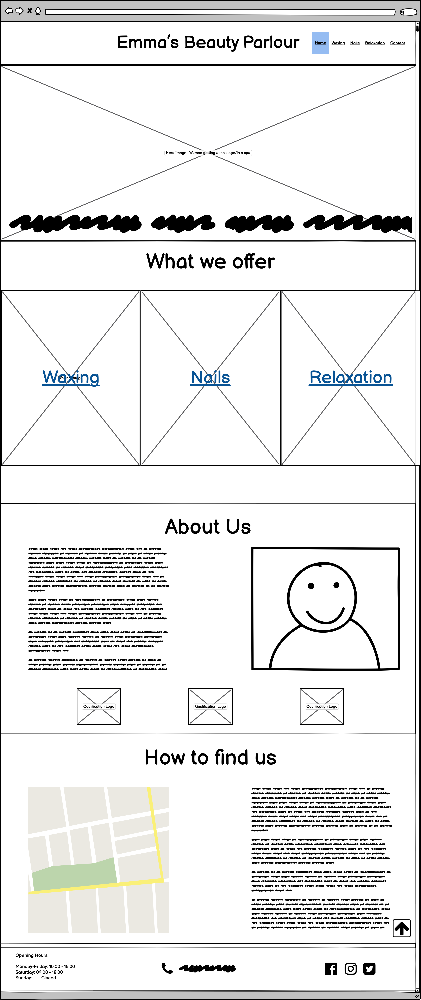
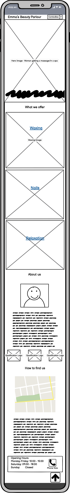
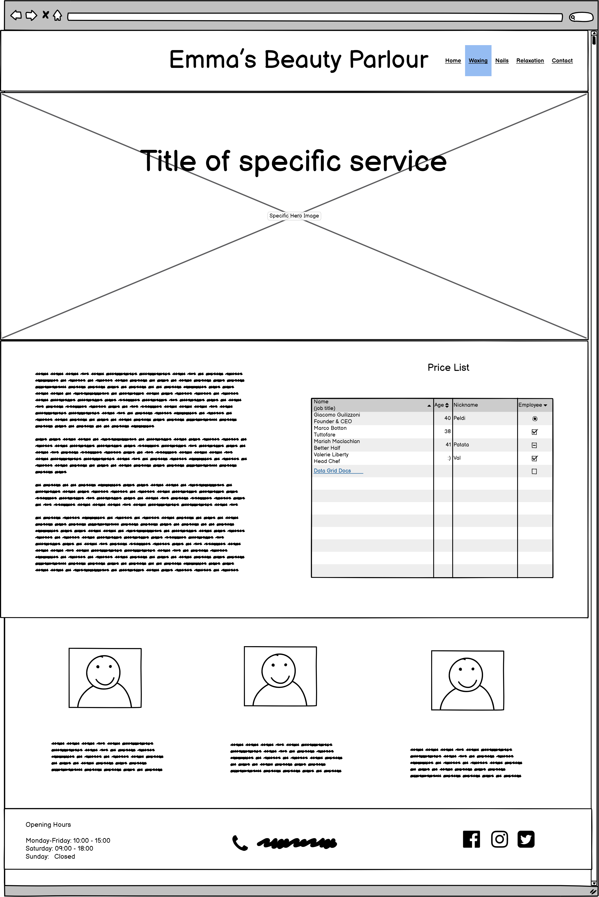
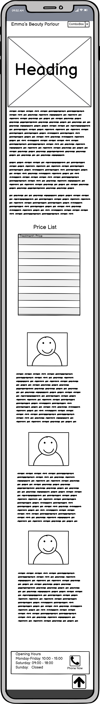
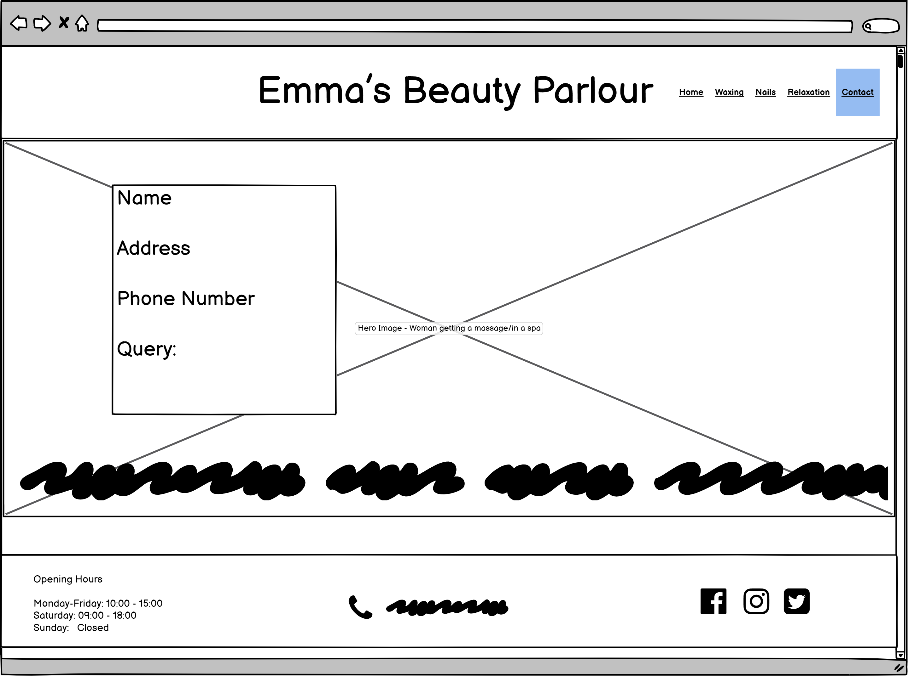
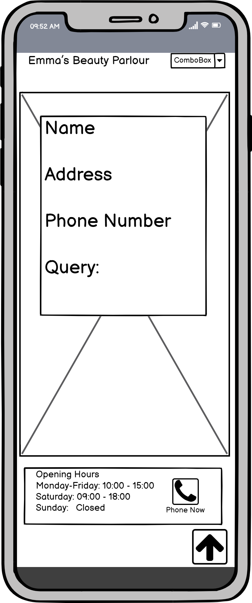

# Emma's Beauty Parlour

Emma's Beauty Parlour is a sole trader beautician business based in Tempo, County Fermanagh, Northern Ireland.

Following a hiatus from work due to a pregnancy and the covid pandemic, the client is recommencing business, but has moved from rented retail premises to premises adjoining her dwelling house.

Until now the client had been using social media channels and word of mouth to drive business leads, but during the pandemic she seen how useful a website was for her competitors during lockdown and now wants to get one set up for her own business.

## Site Design Considerations

### Client Expectations

The basic functions that the client wants the website to feature are:
* a list of the services provided (including pricing structure and any relevant Health & Safety Information)
* a CV/professional experience section
* photos of procedures and/or finished product photos
* detail the new business location
* a section for client testimonials
* a contact/enquiry form

The client wishes the site to convey a feeling of peace and relaxation as is in keeping with the overall ethos of the business and the sector in general.

The client also wishes to have the ability to include extra functionality at a future date, including online booking and eventually an e-commerce section.

If possible, the client also wishes to be able to monitor the traffic to the site.

The website is aimed at a female audience, who make up 95% of the clients custom.

### User Stories/Expectations

1. As a user, I want to easily ascertain the purpose of the website.
2. As a user, I want to be able to easily find out the services on offer.
3. As a user, I want to be able to find out the cost of each service provided. 
4. As a user, I want to be provided with a short description about each service and the time it will take.
5. As a user, I want to be provided with directions to the business.
6. As a user, I want to be able to easily find the business contact details. 
7. As a user, I want to be able to find social media links to the business.
8. As a user, I want to be able to provide feedback or comment through the site without having to exit and use my mail client.
9. As a user, I want to be able to navigate through the site freely, in a manner which is easily understood.
10. As a user with disabilties, I want to be able to navigate through the site freely without obstruction.
11. As user, I want to be able to view the website on any of my devices without any loss of functionality.

<!-- Discuss colour pallette choices-->

## Wireframes

### Homepage

### Services Offered Pages

### Contact Us Page

## Features

### Initial Deployment Features

* Navigation Bar

  * Each page contains a fully responsive identical navigation bar at the top of the screen.
  * Identical styling helps to promote an overall inclusive feel to the site, and pulls pages together across a common theme.
  * The bar contains links to all other pages of the site, enabling the user to quickly navigate through the site without having to utilise their browser navigation buttons.  

* Landing Page Image

* Services Pages

* Location Map

* Contact Form

* Footer

### Future Features

* Online Booking

* Ecommerce Site

## Technologies Used section?

* HTML
* CSS
* Javascript (For Google Map in Location Section)

## Testing

### Validator Testing

* HTML
* CSS

### Unfixed Bugs

## Deployment

The site was deployed to GitHub pages. 

The steps to deploy are as follows:
* In the GitHub repository, navigate to the Settings tab
* From the source section drop-down menu, select the Master Branch
* Once the master branch has been selected, the page will be automatically refreshed with a detailed ribbon display to indicate the successful deployment.

The live link can be found here - 

## Credits

1.  [W3Schools](https://www.w3schools.com/) Tutorials were used to help in the coding of the dropdown navigation bar, the parallax scrolling effect and the insertion of the location map using Google Maps API.

2. The creation and styling of the Polaroid image was adapted from a tutorial by [Savv Studio](https://medium.com/@SavvStudio/tutorial-make-your-images-look-like-polaroid-pictures-with-html-and-css-7b1120732dd1). 

3. I viewed numerous tutorials on Youtube for help with the box model, display properties and the flex-box model. Specifically, tutorials by [Web Dev Simplfied](https://www.youtube.com/channel/UCFbNIlppjAuEX4znoulh0Cw), [Kevin Powell](https://www.youtube.com/channel/UCJZv4d5rbIKd4QHMPkcABCw) and [Traversy Media](https://www.youtube.com/channel/UC29ju8bIPH5as8OGnQzwJyA) helped further my understanding of positioning.  

4. Colour Pallette choice were influenced by a blog piece on calm colour pallettes by the [Muffin Group](https://muffingroup.com/blog/calm-color-palette/) 

5. Images for the site were sourced copyright free from [Pexels](https://www.pexels.com) and [Unsplash](https://unsplash.com). All other pictures are supplied by the developer and are originals by him.

6. Text for the About Us section was adapted from an article by [Emma Hanna Make Up and Beauty](http://emmahanna.com/about-emma-hanna-professional-make-up-artist-belfast-northern-ireland/)