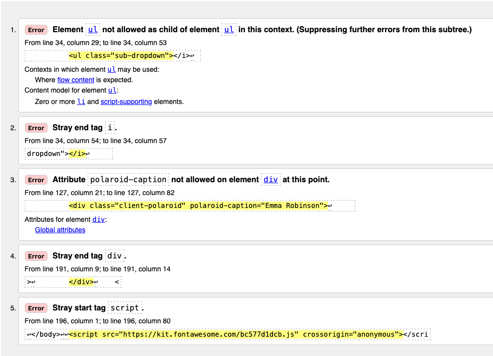
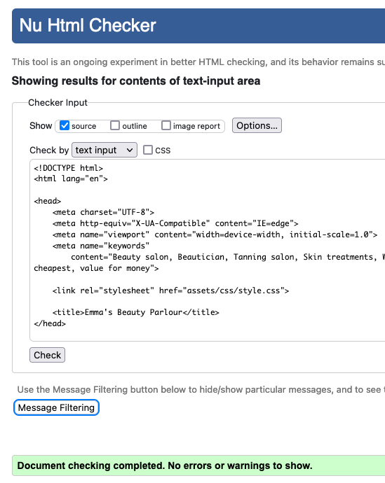
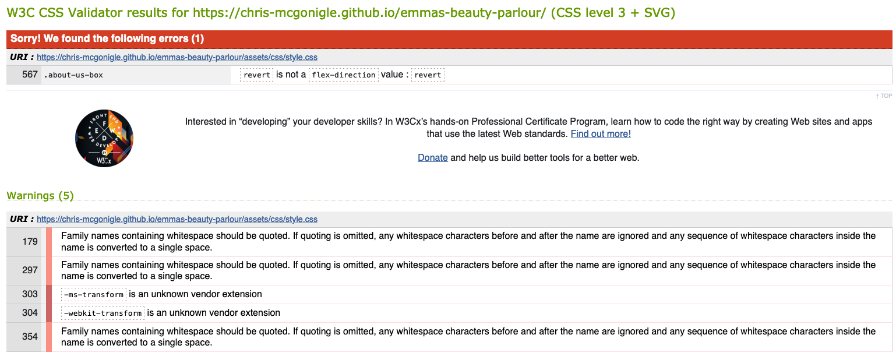
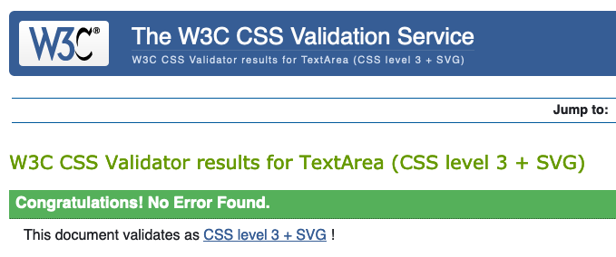
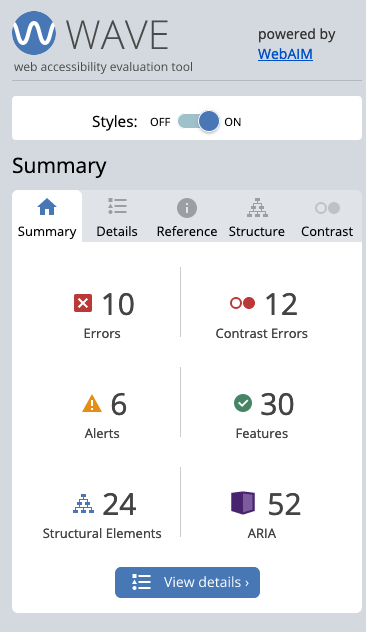
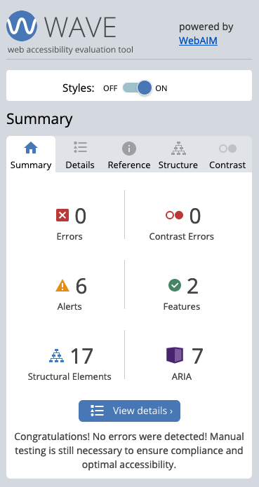
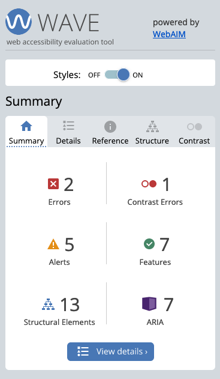

# Testing for client website "Emma's Beauty Parlour"

The following document outlines all testing carried out on the client website, Emma's Beauty Parlour. 

During the initial construction process, the Dev Tools functionality of Firefox was used to test CSS code initially, where it was then tweaked to the desired outcome.  

## Automated Testing

### Validator Testing

* HTML

HTML was tested using the [W3C Markup Validation Service](https://validator.w3.org/)

Four errors were found as detailed in the following screenshot:

 "HTML testing results" 

#### Error fixes

1. Stray li tag was causing this error. Nested li element correctly in dropdown menu. 

Retested: ERROR PASSED.

2. Stray i tag identified. Removed element causing error. 

Retested: ERROR PASSED.

3. Attribute polaroid caption not allowed on div at that point. Added additional div inside parent div to provide caption. Restyled CSS of caption. 

Retested: ERROR PASSED.

4. Stray div tag identified. Removed surplus div tag. 

Retested: ERROR PASSED.

5. Stray script start tag identified. Moved all script elements inside body tags of HTML. 

Retested: ERROR PASSED.

The HTML was then retested in it's entirety. All errors were found to be fixed and no new issues had arisen.

"HTML retest results"

* CSS

CSS was tested using the [W3C CSS Validation Service - Jigsaw](https://jigsaw.w3.org/css-validator/)

One error and five warnings were found as detailed in the following screenshot:

 "CSS testing results"

#### Error and Warning fixes

1. On screens over 800px, flex-direction was set to 'revert'. Changed flex-direction value to 'row'. 

Retested: ERROR PASSED.

2. Font family names contained whitespace in error on lines 179, 297 and 354. Fixed font names to correct syntax. 

Retested: WARNING REMOVED.

3. The transform properties of the polaroid client image presented with an unknown vendor extension warning. Removed -ms and -webkit transform extensions. 

Retested: WARNING REMOVED.

The CSS was then retested in it's entirety. All errors were found to be fixed and warnings removed. No new issues had arisen.

 "CSS retest results"

### Accessibility testing

To test for any accessibility issues, the web accessibility evaluation tool (WAVE) by [WebAIM](https://wave.webaim.org) was used on each page. 

The following results were found.

#### Homepage

 "Homepage accessibility results"

1. The ten errors returned were all due to missing aternative text in the image map area. As this was embedded using a Google API, I am unable to address these errors at present until I have developed further skills in their use. 

Retested: UNABLE TO RETEST.

2. 12 low contrast errors were found on the page. Upon closer investigation, these errors were found to be exclusively on the page headings. 

* Possible solutions were to darken the text colour, or to provide a contrasting background to the headings to help them stand out. 

* Using [Google Colour picker](https://htmlcolors.com/google-color-picker), the original colour #34a0a4, was adjusted to make it slightly darker, whilst still maintaining the original design brief of using calm natural colours such as greens and creams. #27787a was selected and tested. 

Retested: CONTRAST ERRORS FIXED

3. Six alerts were received regarding headings. 

* one skipped heading alert
    * this alert referred to the Mission Statement text across the hero image. The heading was changed from h3 to a h2, and restyled to the desired size and position.

* two possible heading alerts
    * one of these alerts was generated within the Google map iframe which I am unable to address. The second alert was produced by the business phone number, which is set to pargraph text. As this is not a heading, this warning was ignored.

 * one very small text, and two redundant title texts warnings
    * all three of these warnings were generated within the google map iFrame, which again I am unable to amend at this time, but will address at a later date to ensure maximum accessibility.

Retested: ALERTS FIXED WHERE ABLE - MAP ERRORS REMAIN

#### Services Pages

Due to the nature of the three services pages having identical layout, with just the explanatory text and prices changing across the pages, it was found that the accessibility results for these pages were identical, namely:

 "Services pages accessibility results"

No errors were returned on the services pages, due in part to global changes carried out on the Homepage during it's accessibility testing. 

There were however six alerts received:

1. Two alerts were returned due to a nearby image having the same alternative text. 

* These were caused by the avatars used in the client testimonials section. As these are sample placeholders for demonstration purposes, the real testimonials and pictures will have correct and unique alternative text for each testimonial before the site goes publically live. 

* We are still awaiting the actual testimonials from the client. If these are not recived before publication the placeholders will be removed completely and only reinstated once the actual text is in hand. 

2. One possible heading alert was received.

* As with the Homepage accessibility testing, the alert was produced by the business phone number, which is set to pargraph text. As this is not a heading, this warning was ignored.

3. Three broken same-page link warnings were received.

* On investigation, these were caused by links within the navigation bar dropdown menu. Links to Services, About Us and Location were pointing to their respective class name on the homepage, but did not have the page html link inserted before the class name. 

* These links were amended to point to the correct section on the homepage.

Retested: ALERTS FIXED WHERE NECESSARY

#### Contact Form

 "Contact form accessibility results"

1. Two errors were returned for the Contact Form page:

* One was an empty form label. On investigation, this was a missing label for the text input area of the contact form. Adding the label however caused alignment issues within the form itself. This was amended in the CSS of the contact form.

* The second was an empty button. This was caused by the 'Reset' button on the contact form. After discussion with the client, it was agreed to remove this button completely, as due to the small amount of text likely to be provided here a reset mechanism is now not deemed necessary.

Retested: ERRORS PASSED.

2. One contrast error was returned. This was caused by the colour of the submit button. 

* Using [Google Colour picker](https://htmlcolors.com/google-color-picker), the original colour #db9487, was adjusted to make it slightly darker, whilst still maintaining the original design brief. #93625B was selected and tested. 

* The font colour was also changed to white for better contrast. However on button hover this became invisible, so a text colour change on hover was also added for contrast. Site colour #4f5051 was used for this.

3. Five alerts were received for the contact form page

* One alert for a missing fieldset. This was due to the radio button inputs on the contact form. A fieldset and legend were added, and the existing paragraph text removed.

* One possible heading alert was received.

    * As with the Homepage accessibility testing, the alert was produced by the business phone number, which is set to pargraph text. As this is not a heading, this warning was ignored.

* Three broken same-page link warnings were received.

    * As before, these were caused by links within the navigation bar dropdown menu. Links to Services, About Us and Location were pointing to their respective class name on the homepage, but did not have the page html link inserted before the class name. These links were amended to point to the correct section on the homepage.

    Retested: ALERTS FIXED WHERE NECESSARY